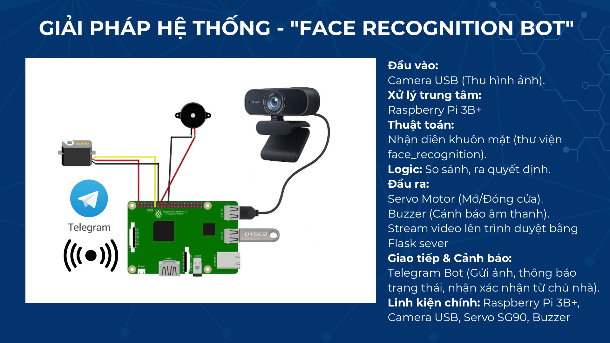
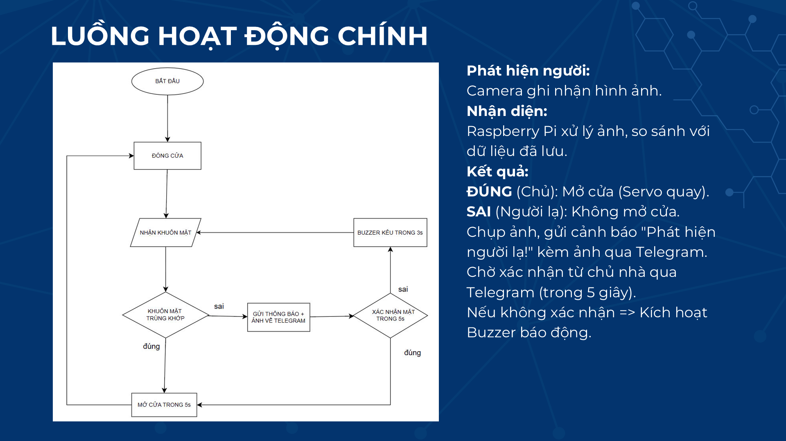

# Face Recognition Bot

A smart solution for facial recognition security using Python and Raspberry Pi 3 Model B+.

## Overview

This project implements a facial recognition system that can identify known faces (authorized users) and detect unknown faces. It provides a security solution that can be integrated with IoT devices, specifically designed to run on a Raspberry Pi 3 Model B+.

## Features

- Real-time face detection
- Recognition of authorized users
- Alerting on unknown face detection
- Integration capabilities with various IoT platforms

## Solution Architecture



## System Flow



## Project Structure

```
├── camdoor.py        # Main camera handling and door control module
├── config.py         # Configuration settings
├── known_faces       # Directory containing authorized user face images
│   └── owner.jpg     # Example of an authorized user
├── unknown_faces     # Directory for storing detected unknown faces
```

## Hardware Requirements

- Raspberry Pi 3 Model B+
- Camera module
- Servo motor for door control
- Buzzer for alerts
- GPIO connections

## Software Requirements

- Raspberry OS

### Libraries

- OpenCV (cv2) - Computer vision and image processing
- NumPy - Numerical operations and arrays
- face_recognition - Face detection and recognition
- gpiozero - GPIO control for Raspberry Pi
- pigpio - Enhanced GPIO pin factory
- python-telegram-bot - Telegram bot integration
- Flask - Web server for video streaming
- time - Time-related functions
- threading - Multi-threading support
- logging - Logging functionality
- os - Operating system interactions

### Python Version

- Python 3.6+

## Installation

1. Clone this repository
2. Install required packages:
   ```
   pip install opencv-python face_recognition gpiozero pigpio python-telegram-bot flask numpy
   ```
3. Configure settings in `config.py`
4. Make sure to start pigpio daemon:
   ```
   sudo pigpiod
   ```
5. Run the application:
   ```
   python camdoor.py
   ```

## Usage

1. Add authorized user images to the `known_faces` directory
2. Start the application
3. The system will automatically identify known users and detect unknown faces
4. Unknown faces will be stored in the `unknown_faces` directory

## Configuration

Adjust parameters in `config.py` to customize:

- Telegram bot settings (BOT_TOKEN, CHAT_ID)

## Features

- Real-time face recognition
- Telegram integration for remote monitoring and control
- Automatic door control via servo motor
- Unauthorized access alerts
- Live video streaming via Flask web server
